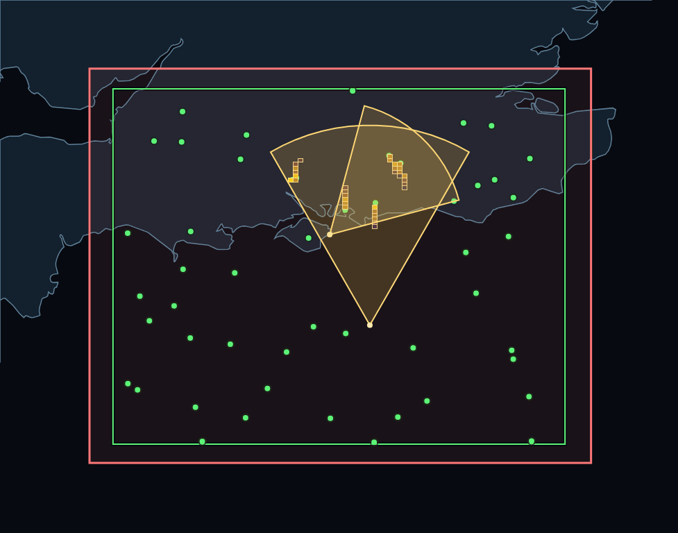

# Locust



Locust is a small lat/lon simulation and visualisation sandbox for experimenting with:

- truth-track generation inside a bounded world
- directional sensor coverage
- ping insertion into a quad-tree heatmap
- live comparison between simulated truth and aggregated heatmap output

## What The Demo Shows

The current demo stack contains four moving parts:

- `Locust.WorldSim`
  Creates moving truth tracks inside a configured world box. Tracks start at random positions, move at fixed speed, and bounce off the world bounds.
- `Locust.SensorSimulator001`
  Polls `WorldSim`, checks which tracks fall inside a forward-looking sensor sector, and publishes heatmap pings into `Locust.Api`.
- `Locust.Api`
  Stores ping data in a quad-tree and supports extraction/query APIs used by the renderer.
- `Locust.Heatmap`
  Renders a map-style image showing:
  - green truth data from `WorldSim`
  - yellow quad-tree heatmap cells
  - sensor sectors
  - the world bounding box
  - coastline overlay data

In the current visual language:

- green means original simulation truth data
- yellow means heatmap data derived from sensor detections

## Current Scenario

The default scenario is a small area around the south coast of England, with:

- a world box centred around `50.5N, -1.0`
- multiple bouncing truth tracks
- two simulated sensors
- live frame rendering suitable for animation capture

## Running The Stack

Use:

```bat
start-locust-stack.bat
```

That launches:

- `Locust.Api`
- `Locust.WorldSim`
- `Locust.SensorSimulator001` on `http://localhost:5200`
- a second sensor instance on `http://localhost:5201`
- `Locust.Heatmap`

## Useful Outputs

- Live heatmap image: `heatmap_level7.png`
- Captured animation frames: `media/capture-*`
- Example animated GIF: `media/capture-20260716-001559/capture-20260716-001559-2x.gif`

## Project Direction

This repo has moved beyond the earlier input-simulator-only approach. The focus now is on modelling:

- a simple world state
- one or more sensors observing that world
- the difference between truth and sensor-derived spatial heat

That makes it a useful testbed for tuning spatial indexing, sensor geometry, persistence/decay behaviour, and future map-backed visualisation.
